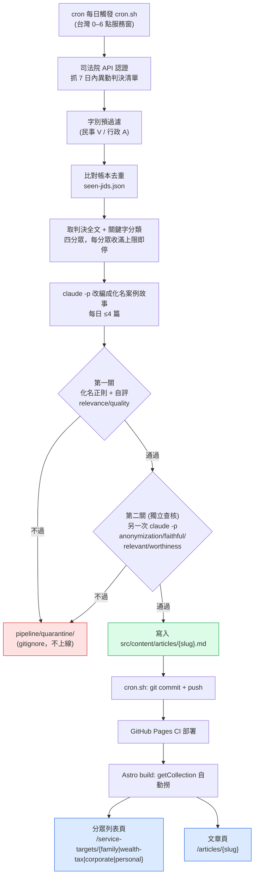

# 判決案例故事 pipeline — 運作說明與 server 接手 runbook

這份文件說明 pipeline **怎麼自動寫文章、文章怎麼出現在網站上**，以及 **server 要做哪些事才能讓它每天自動運作**。技術細節（各模組職責、DNS、字號擷取）見同目錄 `README.md`，這裡聚焦「運作原理」與「上線步驟」。

---

## 一句話

每天凌晨（台灣時間，落在司法院 API 服務窗 0–6 點）自動抓最新判決，用 `claude -p`（訂閱帳戶、**不走 Anthropic API 計費**）化名改編成案例故事，通過雙重防護閘門後自動 `commit + push`，觸發 GitHub Pages 部署，文章就出現在網站對應的「服務對象」分眾頁。

---

## 怎麼運作寫文章（端到端）



### 四分眾與分類

| 分眾 key | 列表頁 | slug 前綴 | 採用裁判類別 | 關鍵字（節錄） |
|---|---|---|---|---|
| `wealth-tax` 財富稅務 | `/service-targets/wealth-tax` | `wealth-tax-story-NN` | 行政 A | 遺產稅、贈與稅、實質課稅… |
| `family` 家庭 | `/service-targets/family` | `family-story-NN` | 民事 V | 遺產、分割、繼承、特留分… |
| `corporate` 公司 | `/service-targets/corporate` | `corporate-story-NN` | 民事 V | 股權、借名登記、經營權… |
| `personal` 個人 | `/service-targets/personal` | `personal-story-NN` | 民事 V | 保險、連帶保證、本票… |

- 分類規則、門檻、上限、hero 圖：`pipeline/config.mjs`。
- slug 自動遞增：掃既有檔推算下一號（目前各分眾有 `-01` 的 Part A 導讀，下一篇即 `-02`）。
- 上限：**每分眾每日 ≤ 1 篇、全站每日 ≤ 4 篇**。

### 文章怎麼出現在網站上

分眾頁是**自動撈取**，不是寫死。例如 `src/pages/service-targets/family.astro`：

```js
(await getCollection('articles')).filter(a => a.data.subcategory === 'family-stories')
```

因此只要產出檔的 frontmatter `subcategory` 正確，下一次 build 就會自動出現在列表頁與 `/articles/{slug}` 文章頁。`markdown.mjs` 會自動補上 frontmatter（含 `caseStory: true`、`caseSource`、hero 圖 credit）與結尾 CTA（電話／信箱／地址）。

### 防護閘門（寧缺勿濫）

- **第一關**：化名正則掃描（身分證／統編／手機／遮蔽殘留／門牌地址）+ 改編自評 relevance/quality（門檻見 `config.mjs` 的 `THRESHOLDS`）。
- **第二關（獨立查核）**：第一關通過者再用**另一次 `claude -p`** 以不同視角獨立判斷 anonymization / faithful（忠於原判決）/ relevant / worthiness（故事性）。對抗同一模型的自評盲點，並挑掉「最新但無故事性」的判決。
- 任一不過 → 寫入 `pipeline/quarantine/`（已 gitignore，**不發佈**），等人工檢視。每件最多 2 次 `claude -p`（改編 + 查核），每日 ≤ 8 次。

---

## server 接手 runbook（讓它每天自動運作）

> **重要：把程式碼 + 這份文件 push 到 GitHub，server 不會自動開始跑。** 還需要在 server 上完成以下一次性設定。push 只是讓 server `git pull` 拿得到程式碼。

### 0. 前置需求

- Node ≥ 22
- Claude Code CLI（`claude`）
- server 連得到 `data.judicial.gov.tw`（DNS 由 `judicial.mjs` 內建公共 DNS 1.1.1.1 / 8.8.8.8 處理，無需改系統 DNS；本環境實測非台灣雲端 IP 亦可連）

### 1. 取得程式碼

```bash
git clone <repo> && cd www.dreamer868.com
# 或既有 repo：git pull
pnpm install
```

### 2. claude 認證（headless，無互動登入）

server 無法互動登入，需用長效 token：

```bash
# 在「已登入 claude 的機器」上執行：
claude setup-token
# 把產生的 token 填到 server 的 pipeline/.env：
#   CLAUDE_CODE_OAUTH_TOKEN=sk-ant-oat...
```

`cron.sh` 會 `source` `.env`，`claude -p` 自動讀取此 token。

### 3. 填 `.env`

```bash
cp pipeline/.env.example pipeline/.env
# 編輯 pipeline/.env：
#   JUD_USER / JUD_PASS         ← 司法院資料開放平臺帳密（必填）
#   CLAUDE_CODE_OAUTH_TOKEN     ← 上一步的長效 token（server 必填）
```

`pipeline/.env` 已 gitignore，不會被推上去。

### 4. git push 認證

server 需有對本 repo 的 **push 權限**（部署金鑰或 PAT），`cron.sh` 末段才能 `git push` 觸發網站部署。先手動驗證一次 `git push` 能通。

### 5. 先乾跑驗證（強烈建議，於台灣 0–6 點服務窗內）

```bash
# 在 pipeline/.env 設 DRY_RUN=1
node pipeline/run.mjs
# 全跑（抓取+分類+改編+雙關卡）但不寫正式檔、不更新帳本、不 commit
# 結果在 pipeline/quarantine/ 供檢視
```

確認分類命中與改編品質 OK 後，**移除 `.env` 的 `DRY_RUN`**，再交給 cron。

### 6. 掛 cron

```bash
crontab -e
```

- server 時區為**台灣**：
  ```
  0 1 * * * /絕對路徑/到/repo/pipeline/cron.sh >> /tmp/judgment-pipeline.log 2>&1
  ```
- server 為 **UTC**：用 `0 17 * * *`（=台灣 01:00），或在 crontab 上方加 `TZ=Asia/Taipei` 後用 `0 1 * * *`。

`cron.sh` 會動態解析 repo 路徑（`dirname/..`），所以不論 clone 在哪都能用。

---

## 日常監控與故障排除

- **執行日誌**：`/tmp/judgment-pipeline.log`（cron 重導向的輸出）。每次跑會印 summary：異動清單數／候選數／發佈數（含 slug）／隔離數（含原因）。
- **沒出文章但 cron 有跑**：看 log 的隔離原因——
  - `gate1(...)`：第一關沒過（自評分數低或化名正則命中殘留）。
  - `gate2(...)`：第二關沒過（不忠於原判決／故事性不足等）。
  - `rewrite:...`：`claude -p` 改編失敗（token 失效、逾時）。
  - 「無新文章可提交」：當天沒有命中分類的新判決，屬正常。
- **token 失效**：log 出現 `claude exit` / `claude_error` → 重新 `claude setup-token` 更新 `.env`。
- **帳本**：`pipeline/state/seen-jids.json` 記錄已處理 JID 避免重複。正式跑後才會有內容；目前為空表示正式流程尚未真跑過。
- **過閘門但不想要的文章**：是直接寫進 `src/content/articles/` 並已 push，需手動刪檔再 commit。
- **單元測試**（不碰網路/claude）：`pnpm test:pipeline`。
- **離線開發**（不碰即時 API，用合成 fixture）：`node pipeline/dev-run.mjs`，產出在 `pipeline/quarantine/dev-*.md`。

---

## 目前狀態（2026-06-16）

- 核心引擎、雙關卡、四分眾、字號擷取、列表頁自動撈：**已完成並通過離線端到端實跑**。
- 正式流程**尚未真跑過**（`seen-jids.json` 為空）。
- 上線尚缺：在真實服務窗用 `DRY_RUN=1` 驗證真判決品質 → 移除 DRY_RUN → 掛 cron（本機或 server）。
